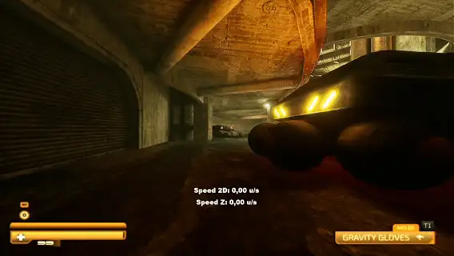
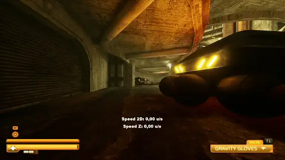
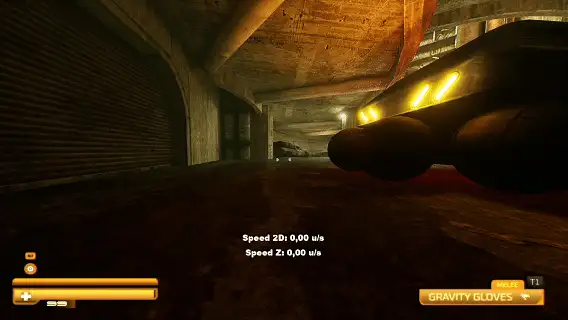
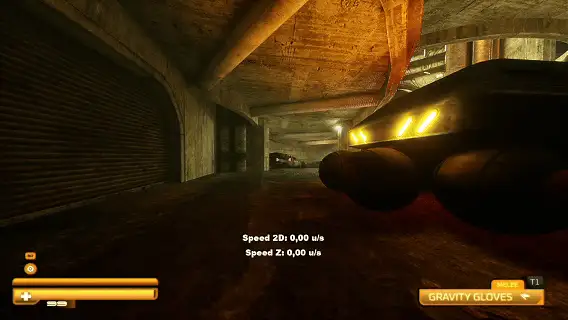
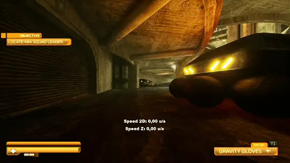

# 

Table of Contents:

  - [Basic Movement Mechanics](#basic-movement-mechanics)
  - [Advanced Movement Techs](#advanced-movement-techs)
    - [Bunnyhop (BHop)](#bunnyhop-bhop)
    - [Side Sliding](#side-sliding)
    - [Crouch Hopping](#crouch-hopping)
    - [Powered Crouch Hopping](#powered-crouch-hopping)
  - [Patch-Dependent Techs](#patch-dependent-techs)
    - [Double Jumping (Demo's Current Version)](#double-jumping-demos-current-version)

## Basic Movement Mechanics

The game has several basic movement mechanics. The main ones are sprinting, jumping, sliding and, of course, default movement. Player's speed is measured in units per second (u/s).

Default movement gives you 500 u/s:

Sprint increases your speed up to 750 u/s, and crouch reduces it to 400 u/s:

 

Sliding adds 100 u/s to sprinting speed, bringing it to 850 u/s:

And jumping gives the player 750 u/s on the vertical (Z) axis:

## Advanced Movement Techs

### Bunnyhop (BHop)

As soon as the demo was released, many people discovered that the game has bunnyhop. Bunnyhop (also known as BHop) is a technique where you continuously press Jump, A or D and move your mouse in the direction of your movement. Unlike in the id Tech or Source engines, jumping on inclined surfaces here does not affect the player's speed.

### Side Sliding

I should also mention one simple technique which will be important later — Side Sliding. As the name says, you need to slide to the side, using W+A or W+D. This method of sliding adds ~300 u/s to sprinting speed, bringing it up to 1050 u/s.

### Crouch Hopping

As you may know, you can do slides and gain an additional 100 u/s. But if you press crouch in mid-air, you'll get an additional 250–300 u/s. This is called Crouch Hopping.

### Powered Crouch Hopping

And if you combine the Crouch Hopping and Side Sliding techniques, you'll get even more speed: instead of the usual 250–300 u/s boost, you'll get a 400 u/s boost. This is called Powered Crouch Hopping. You can get up to 3300 u/s using only 5 Side Slides, while default Crouch Hops give you around 2750 u/s.

## Patch-Dependent Techs

### Double Jumping (Demo's Current Version)

This is a bug that appeared in the current version of the demo, and it doesn't work on the older one. The technique is very simple — you just need to press Jump twice to get a double jump. You can do even more jumps if you spam your spacebar, but this is not really consistent.

