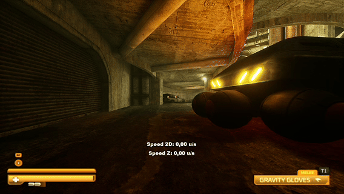

# Movement Techs

Table of Contents:
- [Movement Techs](#movement-techs)
  - [Basic Movement Mechanics](#basic-movement-mechanics)
   

## Basic Movement Mechanics

Game has sevral basic movement mechanics. Main ones are sprinting, jumping, sliding and, of cource, default movement. Player's speed is counted in units per second (u/s).

Default movement gives you 500 u/s:

Sprint increases your speed up to 750 u/s and crouch reduses to 400 u/s:

